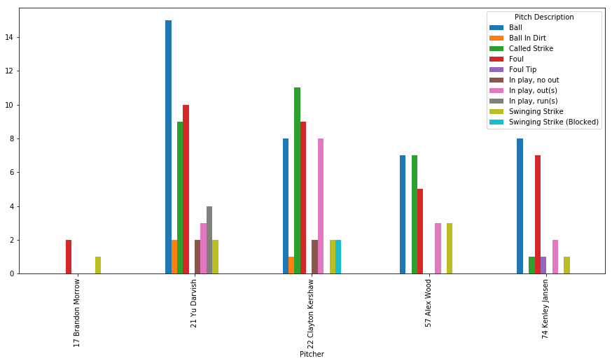
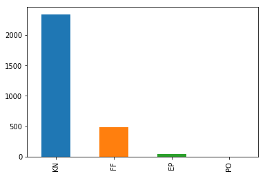
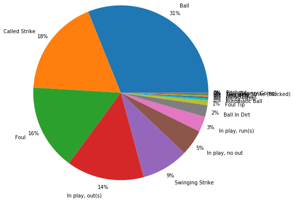
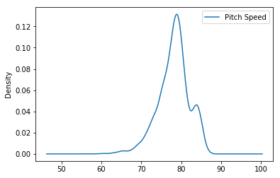
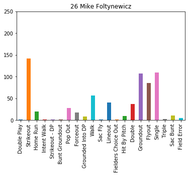
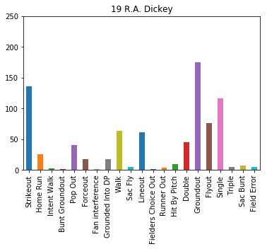
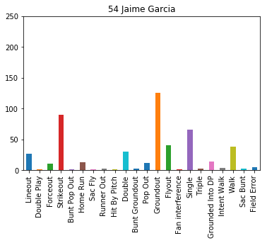
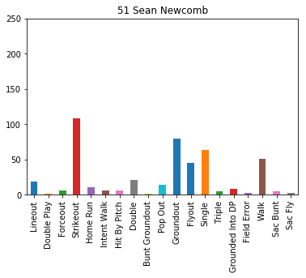
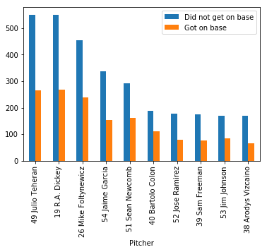

**Table of Contents**

- [Baseball](#baseball)
    - [Installing from pypi](#installing-from-pypi)
    - [Installing from source](#installing-from-source)
    - [Fetch individual MLB game](#fetch-individual-mlb-game)
    - [Fetch list of MLB games](#fetch-list-of-mlb-games)
    - [Game Class Structure](#game-class-structure)
        - [Game](#game)
        - [Team](#team)
        - [Inning](#inning)
        - [PlateAppearance](#plateappearance)
        - [Player](#player)
        - [PlayerAppearance](#playerappearance)
        - [Pitch](#pitch)
        - [Pickoff](#pickoff)
        - [RunnerAdvance](#runneradvance)
        - [Substitution](#substitution)
        - [Switch](#switch)
    - [Analyze a game: 2017 World Series - Game 7](#analyze-a-game-2017-world-series---game-7)
    - [Analyze a player's season: R.A. Dickey - 2017](#analyze-a-players-season-ra-dickey---2017)
    - [Analyze a lineup of pitchers: Atlanta Braves - 2017 Regular Season](#analyze-a-lineup-of-pitchers-atlanta-braves---2017-regular-season)

# Baseball
This package fetches and parses event data for Major League Baseball games.

## Installing from pypi
```
pip3 install baseball
```
## Installing from source
```
git clone git@github.com:benjamincrom/baseball.git
cd baseball/
python3 setup.py install
```

## Fetch individual MLB game
* __get_game_from_url(__*date_str, away_code, home_code, game_number*__)__

Fetch an object which contains metadata and events for a single MLB game.
```python
import baseball
game_id, game = baseball.get_game_from_url('2017-11-1', 'HOU', 'LAD', 1)
```
Write scorecard as SVG image:
```python
with open(game_id + '.svg') as fh:
    fh.write(game.get_svg_str())
```

## Fetch list of MLB games
* __get_game_list_from_file_range(__*start_date_str, end_date_str, input_dir*__)__

Fetch a list of game objects which each contain metadata and events for a single MLB game.

First, download and unzip the [source data zip file](https://spaces-host.nyc3.digitaloceanspaces.com/livebaseballscorecards-artifacts/baseball_files_2008-2017.zip):
```shell
wget https://spaces-host.nyc3.digitaloceanspaces.com/livebaseballscorecards-artifacts/baseball_files_2008-2017.zip
unzip baseball_files_2008-2017.zip -d ./baseball_files_2008-2017
```
Then import the files in Python using this library:
```python
import baseball
game_tuple_list = baseball.get_game_list_from_file_range('1-1-2017', '12-31-2017', 'baseball_files_2008-2017')
```
See [the included Jupyter notebook](baseball_stats.ipynb) for examples on how to use a game object for analysis.

## Game Class Structure
### Game
- away_batter_box_score_dict
- away_pitcher_box_score_dict
- away_team ([Team](#team))
- away_team_stats
- first_pitch_datetime
- first_pitch_str
- game_date_str
- home_batter_box_score_dict
- home_pitcher_box_score_dict
- home_team ([Team](#team))
- home_team_stats
- inning_list (Inning list)
- last_pitch_datetime
- last_pitch_str
- location
- get_svg_str()

### Team
- abbreviation
- batting_order_list_list (List of nine [PlayerAppearance](#playerappearance) lists)
- name
- pitcher_list ([PlayerAppearance](#playerappearance) list)
- player_id_dict
- player_last_name_dict
- player_name_dict

### Inning
- bottom_half_appearance_list ([PlateAppearance](#plateappearance) list)
- bottom_half_inning_stats
- top_half_appearance_list ([PlateAppearance](#plateappearance) list)
- top_half_inning_stats

### PlateAppearance
- batter ([Player](#player))
- batting_team ([Team](#team))
- error_str
- event_list (list: Pitch, Pickoff, RunnerAdvance, Substitution, Switch objects)
- got_on_base
- hit_location
- inning_outs
- out_runners_list ([Player](#player) list)
- pitcher ([Player](#player))
- plate_appearance_description
- plate_appearance_summary
- runners_batted_in_list ([Player](#player) list)
- scorecard_summary
- scoring_runners_list ([Player](#player) list)

### Player
- era
- first_name
- last_name
- mlb_id
- number
- obp
- slg

### PlayerAppearance
- start_inning_batter_num
- start_inning_half
- start_inning_num
- end_inning_batter_num
- end_inning_half
- end_inning_num
- pitcher_credit_code
- player_obj ([Player](#player))
- position

### Pitch
- pitch_description
- pitch_position
- pitch_speed
- pitch_type

### Pickoff
- pickoff_description
- pickoff_base
- pickoff_was_successful

### RunnerAdvance
- run_description
- runner ([Player](#player))
- start_base
- end_base
- runner_scored
- run_earned
- is_rbi

### Substitution
- incoming_player ([Player](#player))
- outgoing_player ([Player](#player))
- batting_order
- position

### Switch
- player ([Player](#player))
- old_position_num
- new_position_num
- new_batting_order


## Analyze a game: 2017 World Series - Game 7


```python
from pandas import DataFrame, read_csv
import matplotlib.pyplot as plt
import pandas as pd
import sys
import matplotlib

import baseball

%matplotlib inline

game_id, game = baseball.get_game_from_url('11-1-2017', 'HOU', 'LAD', 1)

pitch_tuple_list = []
for inning in game.inning_list:
    for appearance in inning.top_half_appearance_list:
        for event in appearance.event_list:
            if isinstance(event, baseball.Pitch):
                pitch_tuple_list.append(
                    (str(appearance.pitcher), 
                     event.pitch_description,
                     event.pitch_position,
                     event.pitch_speed,
                     event.pitch_type)
                )

data = pd.DataFrame(data=pitch_tuple_list, columns=['Pitcher', 'Pitch Description', 'Pitch Coordinate', 'Pitch Speed', 'Pitch Type'])
data.head()
```

<table border="1" class="dataframe">
  <thead>
    <tr style="text-align: right;">
      <th></th>
      <th>Pitcher</th>
      <th>Pitch Description</th>
      <th>Pitch Coordinate</th>
      <th>Pitch Speed</th>
      <th>Pitch Type</th>
    </tr>
  </thead>
  <tbody>
    <tr>
      <th>0</th>
      <td>21 Yu Darvish</td>
      <td>Ball</td>
      <td>(155.47, 160.83)</td>
      <td>96.0</td>
      <td>FF</td>
    </tr>
    <tr>
      <th>1</th>
      <td>21 Yu Darvish</td>
      <td>Called Strike</td>
      <td>(107.0, 171.09)</td>
      <td>83.9</td>
      <td>FC</td>
    </tr>
    <tr>
      <th>2</th>
      <td>21 Yu Darvish</td>
      <td>In play, no out</td>
      <td>(115.36, 183.1)</td>
      <td>83.9</td>
      <td>SL</td>
    </tr>
    <tr>
      <th>3</th>
      <td>21 Yu Darvish</td>
      <td>In play, run(s)</td>
      <td>(80.06, 168.03)</td>
      <td>96.6</td>
      <td>FF</td>
    </tr>
    <tr>
      <th>4</th>
      <td>21 Yu Darvish</td>
      <td>Ball</td>
      <td>(54.1, 216.52)</td>
      <td>84.6</td>
      <td>SL</td>
    </tr>
  </tbody>
</table>
</div>

```python
data['Pitcher'].value_counts().plot.bar()
```


```python
for pitcher in data['Pitcher'].unique():
    plt.ylim(0, 125)
    plt.xlim(0, 250)
    bx = [250 - x[2][0] for x in pitch_tuple_list if x[0] == pitcher if 'Ball' in x[1]]
    by = [250 - x[2][1] for x in pitch_tuple_list if x[0] == pitcher if 'Ball' in x[1]]
    cx = [250 - x[2][0] for x in pitch_tuple_list if x[0] == pitcher if 'Called Strike' in x[1]]
    cy = [250 - x[2][1] for x in pitch_tuple_list if x[0] == pitcher if 'Called Strike' in x[1]]
    ox = [250 - x[2][0] for x in pitch_tuple_list if x[0] == pitcher if ('Ball' not in x[1] and 'Called Strike' not in x[1])]
    oy = [250 - x[2][1] for x in pitch_tuple_list if x[0] == pitcher if ('Ball' not in x[1] and 'Called Strike' not in x[1])]
    b = plt.scatter(bx, by, c='b')
    c = plt.scatter(cx, cy, c='r')
    o = plt.scatter(ox, oy, c='g')

    plt.legend((b, c, o),
               ('Ball', 'Called Strike', 'Other'),
               scatterpoints=1,
               loc='upper right',
               ncol=1,
               fontsize=8)

    plt.title(pitcher)
    plt.show()
```


```python
plt.axis('equal')
data['Pitch Description'].value_counts().plot(kind='pie', radius=1.5, autopct='%1.0f%%', pctdistance=1.1, labeldistance=1.2)
```


```python
data.plot.kde()
```


```python
fig, ax = plt.subplots()
ax.set_xlim(50, 120)
for pitcher in data['Pitcher'].unique():
    s = data[data['Pitcher'] == pitcher]['Pitch Speed']
    s.plot.kde(ax=ax, label=pitcher)

ax.legend()
```


```python
fig, ax = plt.subplots()
ax.set_xlim(50, 120)
for desc in data['Pitch Type'].unique():
    s = data[data['Pitch Type'] == desc]['Pitch Speed']
    s.plot.kde(ax=ax, label=desc)

ax.legend()
```





```python
fig, ax = plt.subplots(figsize=(15,7))
data.groupby(['Pitcher', 'Pitch Description']).size().unstack().plot.bar(ax=ax)
```


## Analyze a player's season: R.A. Dickey - 2017


```python
game_list_2017 = baseball.get_game_list_from_file_range('1-1-2017', '12-31-2017', '/Users/benjamincrom/repos/livebaseballscorecards-artifacts/baseball_files')

pitch_tuple_list_2 = []
for game_id, game in game_list_2017:
    if game.home_team.name == 'Atlanta Braves' or game.away_team.name == 'Atlanta Braves':
        for inning in game.inning_list:
            for appearance in (inning.top_half_appearance_list +
                               (inning.bottom_half_appearance_list or [])):
                if 'Dickey' in str(appearance.pitcher):
                    for event in appearance.event_list:
                        if isinstance(event, baseball.Pitch):
                            pitch_tuple_list_2.append(
                                (str(appearance.pitcher), 
                                 event.pitch_description,
                                 event.pitch_position,
                                 event.pitch_speed,
                                 event.pitch_type)
                            )

df = pd.DataFrame(data=pitch_tuple_list_2, columns=['Pitcher', 'Pitch Description', 'Pitch Coordinate', 'Pitch Speed', 'Pitch Type'])
df['Pitch Type'].value_counts().plot.bar()
```





```python
plt.axis('equal')
df['Pitch Description'].value_counts().plot(kind='pie', radius=2, autopct='%1.0f%%', pctdistance=1.1, labeldistance=1.2)
plt.ylabel('')
plt.show()
```





```python
df.dropna(inplace=True)
ax.set_xlim(50, 100)
df.plot.kde()
ax.legend()
```





```python
fig, ax = plt.subplots()
ax.set_xlim(50, 100)
for desc in df['Pitch Type'].unique():
    if desc != 'PO':
        s = df[df['Pitch Type'] == desc]['Pitch Speed']
        s.plot.kde(ax=ax, label=desc)

ax.legend()
```


## Analyze a lineup of pitchers: Atlanta Braves - 2017 Regular Season


```python
import datetime
import dateutil.parser
import pytz
pitch_tuple_list_3 = []
for game_id, game in game_list_2017:
    if game.home_team.name == 'Atlanta Braves' and dateutil.parser.parse(game.game_date_str) > datetime.datetime(2017, 3, 31):
        for inning in game.inning_list:
            for appearance in inning.top_half_appearance_list:
                pitch_tuple_list_3.append(
                    (str(appearance.pitcher),
                     str(appearance.batter),
                     len(appearance.out_runners_list),
                     len(appearance.scoring_runners_list),
                     len(appearance.runners_batted_in_list),
                     appearance.scorecard_summary,
                     appearance.got_on_base,
                     appearance.plate_appearance_summary,
                     appearance.plate_appearance_description,
                     appearance.error_str,
                     appearance.inning_outs)
                )
    if game.away_team.name == 'Atlanta Braves' and dateutil.parser.parse(game.game_date_str) > datetime.datetime(2017, 3, 31):
        for inning in game.inning_list:
            if inning.bottom_half_appearance_list:
                for appearance in inning.bottom_half_appearance_list:
                    pitch_tuple_list_3.append(
                        (str(appearance.pitcher),
                         str(appearance.batter),
                         len(appearance.out_runners_list),
                         len(appearance.scoring_runners_list),
                         len(appearance.runners_batted_in_list),
                         appearance.scorecard_summary,
                         appearance.got_on_base,
                         appearance.plate_appearance_summary,
                         appearance.plate_appearance_description,
                         appearance.error_str,
                         appearance.inning_outs)
                    )

df3 = pd.DataFrame(data=pitch_tuple_list_3, columns=['Pitcher',
                                                     'Batter',
                                                     'Out Runners',
                                                     'Scoring Runners',
                                                     'RBIs',
                                                     'Scorecard',
                                                     'On-base?',
                                                     'Plate Summary',
                                                     'Plate Description',
                                                     'Error',
                                                     'Inning Outs'])

for pitcher in df3['Pitcher'].unique():
    summary = df3[df3['Pitcher'] == pitcher]['Plate Summary']
    s = summary.value_counts(sort=False)
    if len(summary) > 400:
        fig, ax = plt.subplots()
        ax.set_ylim(0, 250)
        s.plot.bar()
        plt.title(pitcher)
        plt.show()

```














```python
x = []
for pitcher in df3['Pitcher'].unique():
    #f = df3[df3['Pitcher'] == pitcher]['On-base?'].value_counts()[0]
    s = df3[df3['Pitcher'] == pitcher]['On-base?'].value_counts()
    if len(s) == 2:
        f = s[0]
        t = s[1]
        x.append((str(pitcher), f, t))

df4 = pd.DataFrame(data=x, columns=['Pitcher',
                                    'Did not get on base',
                                    'Got on base'])

df4.index = df4['Pitcher']
df4.sort_values(by=['Got on base']).nlargest(10, 'Did not get on base').plot.bar()
```



